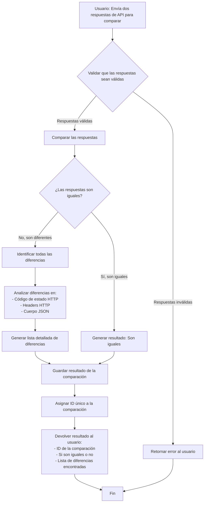
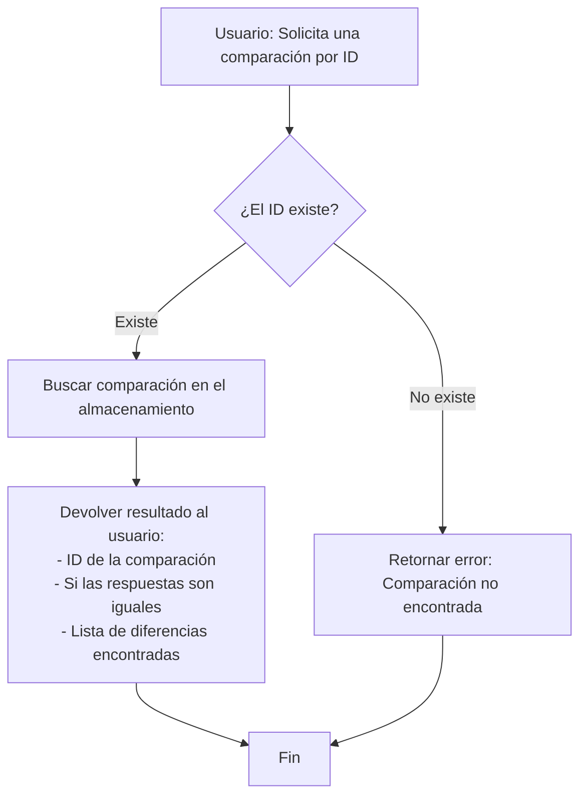

# Diagrama de Flujo - Checker API

## Flujo Principal: Comparación de Respuestas de API

Este diagrama describe el flujo de negocio de la aplicación desde la perspectiva del usuario.

## Flujo Secundario: Consultar Comparación Guardada

## Descripción del Proceso de Negocio

### ¿Qué hace la aplicación?

La aplicación **Checker API** permite comparar dos respuestas de API (HTTP) para identificar si son iguales o qué diferencias existen entre ellas.

### ¿Qué compara?

1. **Código de Estado HTTP**: Verifica si ambas respuestas tienen el mismo código (200, 404, 500, etc.)
2. **Headers HTTP**: Compara los encabezados de ambas respuestas
3. **Cuerpo JSON**: Compara el contenido JSON del cuerpo de las respuestas

### ¿Qué información devuelve?

- Un **ID único** que identifica la comparación realizada
- Un indicador que dice si las respuestas son **iguales o diferentes**
- Una **lista detallada de todas las diferencias** encontradas, indicando:
  - El tipo de diferencia (código de estado, header, campo del body, etc.)
  - La ubicación de la diferencia (por ejemplo: "body.user.name")
  - El valor en la respuesta fuente
  - El valor en la respuesta destino
  - Una descripción legible de la diferencia

### Casos de Uso

1. **Comparar respuestas de diferentes versiones de una API** para verificar que producen los mismos resultados
2. **Validar migraciones** de sistemas comparando respuestas antiguas vs nuevas
3. **Testing de integración** para asegurar que los cambios no rompen la compatibilidad
4. **Auditoría y seguimiento** de cambios en respuestas de API guardando los resultados de las comparaciones
